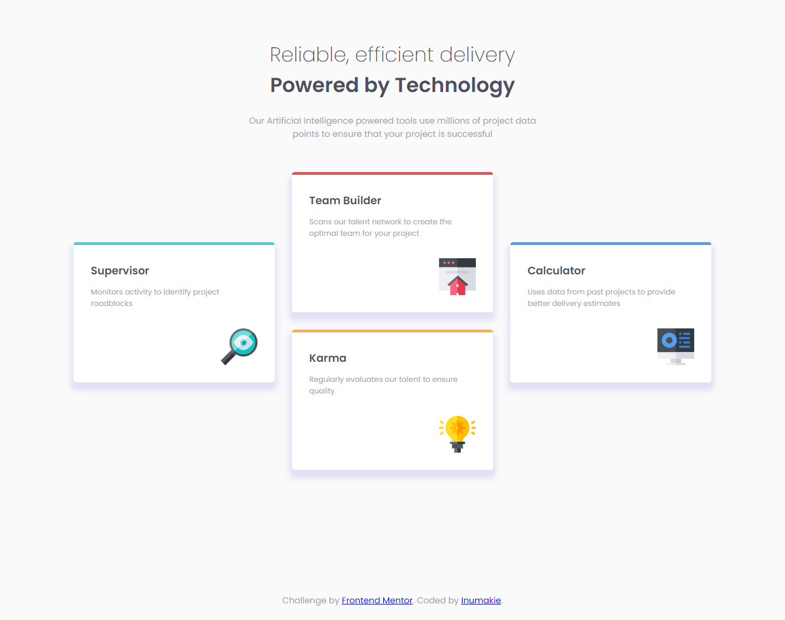
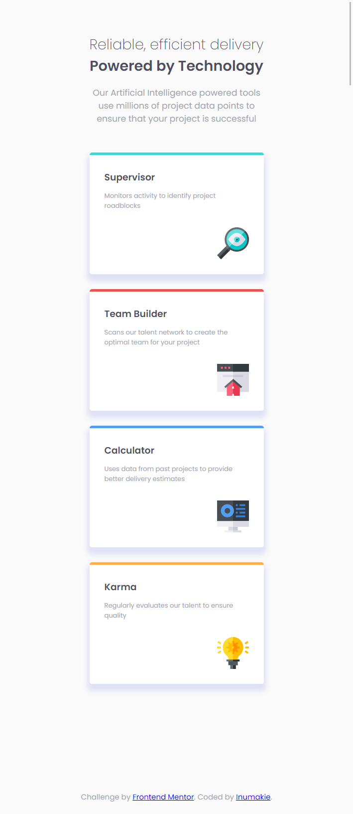

# Frontend Mentor - Four card feature section solution

This is a solution to the [Four card feature section challenge on Frontend Mentor](https://www.frontendmentor.io/challenges/four-card-feature-section-weK1eFYK). Frontend Mentor challenges help you improve your coding skills by building realistic projects. 

## Table of contents

- [Overview](#overview)
  - [The challenge](#the-challenge)
  - [Screenshot](#screenshot)
  - [Links](#links)
- [My process](#my-process)
  - [Built with](#built-with)
  - [What I learned](#what-i-learned)
  - [Useful resources](#useful-resources)
- [Author](#author)

## Overview

### The challenge

Users should be able to:

- View the optimal layout for the site depending on their device's screen size

### Screenshots






### Links

- Solution URL: [https://www.frontendmentor.io/solutions/html-and-css-flex-based-four-card-feature-section--rWdYFx8J]
- Live Site URL: [https://inumakie.github.io/fourcardfeaturesection/]

## My process

### Built with

- Semantic HTML5 markup
- CSS custom properties
- Flexbox

### What I learned

I learned about the 'transform-translate' property, which I used to center the boxes at the sides in the web-version:

```css
.cyan, .blue {
    transform:translateY(50%);
}
```

(!) In mobile version, however, since the four boxes position on top of each other, the first and last boxes would sit on top of the other boxes (since the 'transform-translate' property was being used). So I added a media query to get rid of the property in mobile-version:

```css
@media (max-width:775px) {
    .cyan, .blue {transform: translateY(0%);}
}
```

Other change I implemented in the mobile-version, was adding this code to make the header text stick to the width of the boxes:

```css
@media (max-width:775px) {
    header {max-width:350px; font-size:0.9em;}
    header p {font-size:1.2em;}
}
```
### Useful resources

- [Florin Pop's Youtube Video](https://www.youtube.com/watch?v=PcSUEo0P0GU) - I checked Florin Pop's youtube video tutorial for tips in parts where I'd get stuck.

## Author

- Frontend Mentor - [@inumakie](https://www.frontendmentor.io/profile/inumakie)
- Twitter - [@inumakie999](https://www.twitter.com/inumakie999)
